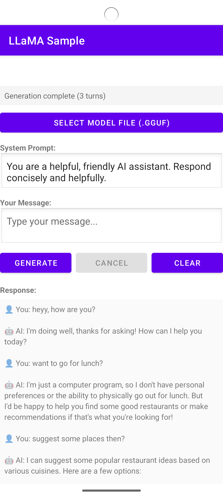

# 🦙 LLaMA Kotlin Android

[](LICENSE)
[](https://android-arsenal.com/api?level=24)
[](https://kotlinlang.org)

A Kotlin-first Android library for running LLaMA models on-device using [llama.cpp](https://github.com/ggerganov/llama.cpp). Lightweight, easy-to-use API with full coroutine support following modern Android best practices.

---

## 📖 Table of Contents

- [Screenshots](#-screenshots-from-sample-app)
- [Quick Start](#-quick-start)
- [Features](#-features)
- [API Reference](#-api-reference)
- [Chat Templates](#-chat-templates)
- [Supported Models](#-supported-models)
- [Architecture](#-architecture)
- [Building from Source](#️-building-from-source)
- [Requirements](#-requirements)
- [Contributing](#-contributing)
- [License](#-license)

---

## 📸 Screenshots from Sample App

<!-- Add screenshots here when available -->
|                      Chat Interface                     |
|:-------------------------------------------------------:|
| |

---

## 🚀 Quick Start

### 1. Add Dependency

```kotlin
dependencies {
    implementation("io.github.it5prasoon:llama-kotlin-android:0.1.0")
}
```

### 2. Download a Model

Recommended models for Android:

| Model | Size | RAM | Download |
|-------|------|-----|----------|
| **Phi-3.5-mini** ⭐ | ~2.4GB | 4-6GB | [Download](https://huggingface.co/bartowski/Phi-3.5-mini-instruct-GGUF/resolve/main/Phi-3.5-mini-instruct-Q4_K_M.gguf) |
| TinyLlama-1.1B | ~670MB | 2GB | [Download](https://huggingface.co/TheBloke/TinyLlama-1.1B-Chat-v1.0-GGUF/resolve/main/tinyllama-1.1b-chat-v1.0.Q4_K_M.gguf) |
| Llama-3.2-3B | ~2GB | 6-8GB | [Download](https://huggingface.co/bartowski/Llama-3.2-3B-Instruct-GGUF/resolve/main/Llama-3.2-3B-Instruct-Q4_K_M.gguf) |
| Qwen2.5-1.5B | ~1GB | 3-4GB | [Download](https://huggingface.co/Qwen/Qwen2.5-1.5B-Instruct-GGUF/resolve/main/qwen2.5-1.5b-instruct-q4_k_m.gguf) |

### 3. Basic Usage

```kotlin
import com.llamakotlin.android.LlamaModel

class MyActivity : AppCompatActivity() {
    private var model: LlamaModel? = null
    
    // Load model
    lifecycleScope.launch {
        model = LlamaModel.load("/path/to/model.gguf") {
            contextSize = 2048
            threads = 4
            temperature = 0.7f
        }
    }
    
    // Generate response (streaming)
    lifecycleScope.launch {
        model?.generateStream("Hello, how are you?")
            ?.collect { token ->
                textView.append(token)
            }
    }
    
    // Clean up
    override fun onDestroy() {
        super.onDestroy()
        model?.close()
    }
}
```

### 4. Run Sample App

```bash
# Clone and build
git clone --recursive https://github.com/it5prasoon/llama-kotlin-android.git
cd llama-kotlin-android
./gradlew :sample:installDebug

# Open app, select model file, start chatting!
```

---

## ✨ Features

- **On-device inference** - No internet required, complete privacy
- **Kotlin-first API** - Idiomatic, DSL-style configuration
- **Full Coroutine Support** - `Flow<String>` for streaming, structured concurrency
- **Conversation History** - Sample app maintains multi-turn context
- **Multiple quantization** - Q4_0, Q4_K_M, Q5_K_M, Q8_0 support
- **Auto-load models** - Sample app remembers last used model
- **Small footprint** - ~15 MB library size (without models)
- **Memory safe** - Automatic resource cleanup with Closeable pattern

---

## 📚 API Reference

### LlamaModel

```kotlin
class LlamaModel : Closeable {
    
    companion object {
        // Load a GGUF model
        suspend fun load(
            modelPath: String, 
            config: LlamaConfig.() -> Unit = {}
        ): LlamaModel
        
        // Get library version
        fun getVersion(): String
    }
    
    // One-shot generation
    suspend fun generate(prompt: String): String
    
    // Streaming generation (recommended)
    fun generateStream(prompt: String): Flow<String>
    
    // Cancel ongoing generation
    fun cancelGeneration()
    
    // Check if model is loaded
    val isLoaded: Boolean
    
    // Clean up resources
    override fun close()
}
```

### Configuration DSL

```kotlin
val model = LlamaModel.load(modelPath) {
    // Context
    contextSize = 2048          // Max context length
    batchSize = 512             // Batch size for prompt processing
    
    // Threading
    threads = 4                 // Number of threads
    threadsBatch = 4            // Threads for batch processing
    
    // Sampling
    temperature = 0.7f          // Randomness (0.0 - 2.0)
    topP = 0.9f                // Nucleus sampling
    topK = 40                   // Top-K sampling
    repeatPenalty = 1.1f       // Repetition penalty
    
    // Generation limits
    maxTokens = 512            // Max tokens to generate
    seed = -1                  // Random seed (-1 = random)
    
    // Memory options
    useMmap = true             // Memory-map model file
    useMlock = false           // Lock model in RAM
    gpuLayers = 0              // GPU layers (0 = CPU only)
}
```

### Exception Handling

```kotlin
try {
    val model = LlamaModel.load(path)
} catch (e: LlamaException.ModelNotFound) {
    // File doesn't exist
} catch (e: LlamaException.ModelLoadError) {
    // Failed to load (invalid format, OOM, etc.)
} catch (e: LlamaException.GenerationError) {
    // Generation failed
}
```

---

## 💬 Chat Templates

Different models require different prompt formats. Here are examples:

### Llama 3.2 / 3.1 Format

```kotlin
fun formatLlama3Prompt(system: String, user: String): String {
    return buildString {
        append("<|begin_of_text|>")
        append("<|start_header_id|>system<|end_header_id|>\n\n")
        append(system)
        append("<|eot_id|>")
        append("<|start_header_id|>user<|end_header_id|>\n\n")
        append(user)
        append("<|eot_id|>")
        append("<|start_header_id|>assistant<|end_header_id|>\n\n")
    }
}
```

### Phi-3 Format

```kotlin
fun formatPhi3Prompt(system: String, user: String): String {
    return "<|system|>\n$system<|end|>\n<|user|>\n$user<|end|>\n<|assistant|>\n"
}
```

### ChatML Format (Qwen, etc.)

```kotlin
fun formatChatML(system: String, user: String): String {
    return buildString {
        append("<|im_start|>system\n$system<|im_end|>\n")
        append("<|im_start|>user\n$user<|im_end|>\n")
        append("<|im_start|>assistant\n")
    }
}
```

---

## 📦 Supported Models

### Recommended for Mobile

| Model | Size | Quality | Speed | Best For |
|-------|------|---------|-------|----------|
| Phi-3.5-mini | 2.4GB | ⭐⭐⭐⭐ | ⭐⭐⭐ | General use |
| TinyLlama-1.1B | 670MB | ⭐⭐ | ⭐⭐⭐⭐⭐ | Testing, low-end devices |
| Qwen2.5-1.5B | 1GB | ⭐⭐⭐ | ⭐⭐⭐⭐ | Coding, reasoning |
| Llama-3.2-3B | 2GB | ⭐⭐⭐⭐⭐ | ⭐⭐ | High quality chat |
| Gemma-2B | 1.2GB | ⭐⭐⭐ | ⭐⭐⭐⭐ | Google alternative |

### Quantization Formats

| Format | Size | Quality | When to Use |
|--------|------|---------|-------------|
| Q4_0 | Smallest | Lower | Memory constrained |
| **Q4_K_M** | Small | **Good** | **Recommended** |
| Q5_K_M | Medium | Better | Quality priority |
| Q8_0 | Large | Best | Accuracy critical |

---

## 🏗️ Architecture

```
┌─────────────────────────────────────────────┐
│              Your Application               │
│    (Activity/ViewModel using LlamaModel)    │
└─────────────────────────────────────────────┘
                      │
                      ▼
┌─────────────────────────────────────────────┐
│            Kotlin API Layer                 │
│  ┌─────────────┐  ┌─────────────────────┐  │
│  │ LlamaModel  │  │   LlamaConfig DSL   │  │
│  │  (suspend)  │  │   LlamaException    │  │
│  └─────────────┘  └─────────────────────┘  │
│         Coroutines + Flow                   │
└─────────────────────────────────────────────┘
                      │
                      ▼
┌─────────────────────────────────────────────┐
│              JNI Bridge                     │
│         llama_jni.cpp + Wrappers           │
└─────────────────────────────────────────────┘
                      │
                      ▼
┌─────────────────────────────────────────────┐
│              Native Layer                   │
│    llama.cpp (GGML, GGUF, Inference)       │
│         ARM NEON optimizations              │
└─────────────────────────────────────────────┘
```

### Project Structure

```
llama-kotlin-android/
├── app/                          # 📦 Library module
│   ├── src/main/
│   │   ├── cpp/                  # C++ native code
│   │   │   ├── llama.cpp/        # llama.cpp submodule
│   │   │   ├── llama_jni.cpp     # JNI bridge
│   │   │   └── llama_context_wrapper.cpp
│   │   └── java/com/llamakotlin/
│   │       ├── LlamaModel.kt     # Main API
│   │       ├── LlamaConfig.kt    # Configuration
│   │       └── exception/        # Exceptions
│
├── sample/                       # 📱 Sample app
│   └── src/main/
│       ├── java/.../MainActivity.kt
│       └── res/layout/activity_main.xml
│
└── README.md
```

---

## 🛠️ Building from Source

### Prerequisites

- Android Studio Ladybug+
- NDK 27.3.13750724
- CMake 3.22.1+

### Build Steps

```bash
# Clone with submodules
git clone --recursive https://github.com/it5prasoon/llama-kotlin-android.git
cd llama-kotlin-android

# Update submodule if needed
git submodule update --init --recursive

# Build library
./gradlew :app:assembleRelease

# Build and install sample
./gradlew :sample:installDebug
```

### Build Outputs

- **AAR**: `app/build/outputs/aar/app-release.aar`
- **Sample APK**: `sample/build/outputs/apk/debug/sample-debug.apk`

---

## 📋 Requirements

| Requirement | Minimum | Recommended |
|-------------|---------|-------------|
| Android API | 24 (7.0) | 26+ (8.0+) |
| RAM | 3 GB | 6+ GB |
| Storage | 1 GB | 4+ GB |
| Architecture | arm64-v8a | arm64-v8a |

### Supported ABIs

- ✅ arm64-v8a (64-bit ARM)
- ❌ armeabi-v7a (disabled - llama.cpp incompatible)
- ✅ x86_64 (Emulator)

---

## 🤝 Contributing

Contributions welcome! Please:

1. Fork the repository
2. Create feature branch (`git checkout -b feature/amazing`)
3. Commit changes (`git commit -m 'Add amazing feature'`)
4. Push (`git push origin feature/amazing`)
5. Open Pull Request

---

## 📄 License

MIT License - see [LICENSE](LICENSE) file.

---

## 🙏 Acknowledgments

- [llama.cpp](https://github.com/ggerganov/llama.cpp) - Incredible C++ inference engine
- [ggml](https://github.com/ggerganov/ggml) - Tensor library for ML
- Meta AI - LLaMA models

---

<p align="center">
  Made with ❤️ for the Android community
</p>
